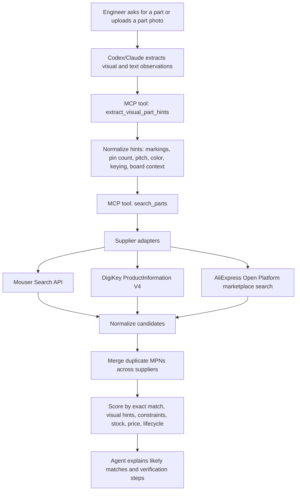

# Parts Finder MCP

Read-only MCP server for finding, comparing, and shortlisting engineering parts from distributor and marketplace APIs.

Parts Finder is designed for Codex, Claude, and other MCP-capable agents that help engineers identify embedded parts, connectors, cables, motors, sensors, PLC components, and related hardware from rough text or image-derived clues.

The project is MIT licensed. Supplier data remains subject to each provider's API terms.

## Status

Implemented:

- Mouser Search API keyword search
- DigiKey ProductInformation V4 keyword search
- AliExpress Open Platform signed read-only marketplace search adapter
- in-memory TTL cache for repeated supplier searches
- candidate confidence summaries and verification checklists
- bounded multi-query expansion from category and visual hints
- Korean and field-language query normalization for common part terms
- automatic connector/motor hint inference from rough query text
- cross-supplier candidate ranking, de-duplication, and constraint filtering
- live lookup, comparison, alternate suggestion, and BOM enrichment flows
- Image-observation normalization through `extract_visual_part_hints`
- Local rate-limit metadata and guardrails
- Codex plugin wrapper and skill
- Smoke tests for Mouser, DigiKey, and MCP stdio execution

Planned:

- supplier-specific datasheet and lifecycle enrichment
- deeper electrical/mechanical parameter extraction from supplier attributes
- stronger alternate-part scoring from package, pinout, ratings, and lifecycle data

## Process Flow



### Image-Based Search Flow

This MCP server does not process raw images directly. The agent should inspect the image first, then pass structured observations into the MCP tool.

Good visual observations include:

- visible text, logos, top markings, labels, and terminal legends
- connector pin count, row count, pitch, color, shroud, key slot, latch, and wire count
- IC package shape, pin count, board position, nearby crystal/regulator/driver/interface parts
- motor diameter, length, shaft type, gearhead, encoder, cable count, and connector type
- cable jacket markings, connector gender, locking style, and estimated length
- scale clues such as USB ports, 2.54 mm headers, terminal blocks, screws, rulers, or known boards

Example:

```json
{
  "userGoal": "identify black shrouded connector on STM32 development board photo",
  "visibleText": ["3V3", "GND", "RST", "A0", "Mini USB"],
  "packageShape": "black shrouded dual-row box header with key slot",
  "connectorPinCount": 20,
  "connectorRowCount": 2,
  "connectorPitchMm": 2.54,
  "connectorFamily": "IDC box header",
  "connectorMountingStyle": "through hole",
  "boardContext": [
    "STM32 style development board",
    "JTAG or SWD debug/programming connector",
    "2x10 IDC ribbon cable header"
  ]
}
```

The resulting search should be verified against dimensions, datasheets, pinout, and mating connector before purchasing.

## Tools

- `search_parts`: search configured suppliers for engineering part candidates.
- `extract_visual_part_hints`: turn image-recognition observations into searchable part hints.
- `lookup_part`: look up a known manufacturer or supplier part number.
- `compare_parts`: compare known candidates.
- `suggest_alternates`: suggest alternate parts with caveats.
- `enrich_bom`: enrich BOM-like rows.

Version 0.1 is read-only. It must not place orders, create carts, call dropshipping/order APIs, or mutate supplier accounts.

### Search Quality Behavior

The MCP now improves rough searches before returning results:

- builds up to four bounded query variants from the original query, category hint, visual hints, and exact-looking part numbers
- normalizes common Korean/field terms such as `2핀`, `커넥터`, `패널마운트`, `방수`, `기어모터`, `엔코더`, `단자대`, `푸시인`, and `PLC 입출력 모듈` into supplier-friendly English search terms
- prioritizes supplier-friendly normalized queries when field-language input was translated, while still preserving the original query for traceability
- scores candidates against those normalized terms too, so field-language searches can match English supplier descriptions more reliably
- infers pin count, row count, pitch, connector family, mounting style, color, wire count, and motor encoder/gearhead hints from rough query text
- returns per-candidate `confidence`, `fitSummary`, and `verificationChecklist` fields to make sourcing decisions easier to audit
- ranks exact manufacturer or supplier part-number matches above loose keyword matches
- merges duplicate candidates that share the same normalized manufacturer part number
- filters hard constraints such as manufacturer, required terms, forbidden terms, max unit price, max MOQ, RoHS, and stock
- extracts supplier attributes/parameters into normalized specs when available
- boosts useful sourcing evidence such as stock, datasheet, product URL, pricing, visual-hint matches, pin count, row count, pitch, mounting style, and connector family
- lowers confidence for obsolete/discontinued lifecycle text and marketplace results unless marketplace use is explicitly allowed

The same ranked search foundation powers `lookup_part`, `compare_parts`, `suggest_alternates`, and `enrich_bom`.

## Requirements

- Node.js 20 or newer
- npm
- API credentials for any supplier you want to enable

## Install

```bash
npm install
npm run build
```

## Run Locally

```bash
npm run dev
```

For built stdio execution:

```bash
npm run build
npm start
```

Without API keys, the MCP server still starts and reports skipped-supplier status. This lets Codex, Claude, or MCP Inspector validate tool wiring before credentials exist.

## Environment Setup

Copy `.env.example` to `.env`.

```bash
cp .env.example .env
```

On Windows PowerShell:

```powershell
Copy-Item .env.example .env
```

Never commit `.env`. Keep all supplier secrets local.

### Common Settings

```env
PARTS_FINDER_LOG_LEVEL=info
PARTS_FINDER_CACHE_DIR=.cache/parts-finder
PARTS_FINDER_CACHE_TTL_SECONDS=300
PARTS_FINDER_DEFAULT_COUNTRY=US
PARTS_FINDER_DEFAULT_LANGUAGE=en
PARTS_FINDER_DEFAULT_CURRENCY=USD
```

`PARTS_FINDER_CACHE_TTL_SECONDS` controls the in-memory supplier search cache. The cache reduces repeated API calls across expanded queries, `lookup_part`, `compare_parts`, and BOM enrichment while the MCP server process is running. Set it to `0` to disable caching. `PARTS_FINDER_CACHE_DIR` is reserved for future persistent cache support.

### Mouser

Required:

```env
MOUSER_SEARCH_API_KEY=
MOUSER_API_BASE_URL=https://api.mouser.com
```

Optional local guardrails:

```env
MOUSER_RATE_LIMIT_PER_MINUTE=30
MOUSER_RATE_LIMIT_PER_DAY=1000
```

Get a Mouser Search API key from the Mouser API Hub. The current adapter uses keyword search and normalizes returned candidates into the MCP part schema.

### DigiKey

Required:

```env
DIGIKEY_CLIENT_ID=
DIGIKEY_CLIENT_SECRET=
DIGIKEY_LOCALE_SITE=US
DIGIKEY_LOCALE_LANGUAGE=en
DIGIKEY_LOCALE_CURRENCY=USD
DIGIKEY_CUSTOMER_ID=0
```

Production:

```env
DIGIKEY_SANDBOX=false
DIGIKEY_API_BASE_URL=https://api.digikey.com
DIGIKEY_TOKEN_URL=https://api.digikey.com/v1/oauth2/token
```

Sandbox:

```env
DIGIKEY_SANDBOX=true
DIGIKEY_SANDBOX_API_BASE_URL=https://sandbox-api.digikey.com
DIGIKEY_TOKEN_URL=https://sandbox-api.digikey.com/v1/oauth2/token
```

Important DigiKey notes:

- ProductInformation V4 uses OAuth 2.0 client credentials for this MCP use case.
- The app must be authorized for ProductInformation V4 in the same environment as the token endpoint.
- Production credentials work with `api.digikey.com`; sandbox credentials work with `sandbox-api.digikey.com`.
- If the token endpoint returns `401 Invalid clientId`, the Client ID is invalid for that endpoint/environment.
- If OAuth succeeds but product search returns `403`, the app is likely not authorized or subscribed to the requested ProductInformation API.
- The DigiKey portal may ask for an OAuth callback URL. For this client-credentials flow it is not used at runtime; `https://localhost` is acceptable as a placeholder if the field is required.

Optional local guardrails:

```env
DIGIKEY_PRODUCT_INFORMATION_RATE_LIMIT_PER_MINUTE=120
DIGIKEY_PRODUCT_INFORMATION_RATE_LIMIT_PER_DAY=1000
```

### AliExpress

AliExpress support is read-only and only participates in `search_parts` when `constraints.marketplaceAllowed` is `true`. This prevents marketplace listings from silently mixing into production distributor recommendations.

The Open Platform exposes different product-search APIs depending on app approval and product line. Set `ALIEXPRESS_PRODUCT_SEARCH_PATH` to the search API path granted to your app. The default is a dropshipping-style text search path.

```env
ALIEXPRESS_APP_KEY=
ALIEXPRESS_APP_SECRET=
ALIEXPRESS_ACCESS_TOKEN=
ALIEXPRESS_REFRESH_TOKEN=
ALIEXPRESS_API_BASE_URL=https://api-sg.aliexpress.com
ALIEXPRESS_PRODUCT_SEARCH_PATH=/aliexpress/ds/textsearch
ALIEXPRESS_OAUTH_AUTHORIZE_URL=https://api-sg.aliexpress.com/oauth/authorize
ALIEXPRESS_TOKEN_CREATE_PATH=/auth/token/security/create
ALIEXPRESS_TOKEN_REFRESH_PATH=/auth/token/refresh
ALIEXPRESS_COUNTRY=US
ALIEXPRESS_CURRENCY=USD
ALIEXPRESS_LANGUAGE=en_US
ALIEXPRESS_RATE_LIMIT_PER_SECOND=
ALIEXPRESS_RATE_LIMIT_PER_DAY=
```

AliExpress rate limits vary by app key, API, and app-key/API combination. Copy the approved quotas from the Open Platform console after the app is reviewed.

Marketplace caveat: AliExpress results should be treated as prototyping or long-tail sourcing leads unless the exact seller, variant, dimensions, authenticity, shipping terms, and ratings are verified.

## MCP Configuration

After `npm run build`, add this server to an MCP-capable client.

```json
{
  "mcpServers": {
    "parts-finder": {
      "command": "node",
      "args": ["C:/absolute/path/to/parts-finder-mcp/dist/index.js"]
    }
  }
}
```

If the client does not load `.env` from the project directory, pass environment variables explicitly in the MCP config or launch the client from the project root.

## Codex Plugin

The Codex plugin wrapper lives at:

```text
plugins/codex/parts-finder
```

It contains:

- `.codex-plugin/plugin.json`
- `.mcp.json`
- `skills/parts-sourcing/SKILL.md`

Validate it with:

```bash
python C:/Users/googo/.codex/skills/.system/plugin-creator/scripts/validate_plugin.py plugins/codex/parts-finder
```

The plugin `.mcp.json` points to the built MCP server:

```json
{
  "mcpServers": {
    "parts-finder": {
      "command": "node",
      "args": ["../../../dist/index.js"],
      "env": {
        "PARTS_FINDER_LOG_LEVEL": "info"
      }
    }
  }
}
```

## Smoke Tests

Build first:

```bash
npm run build
```

Run supplier smoke tests:

```bash
npm run smoke:mouser
npm run smoke:digikey
```

Run MCP stdio smoke tests:

```bash
npm run smoke:mcp
npm run smoke:mcp-cache
npm run smoke:mcp-fit-summary
npm run smoke:mcp-digikey
npm run smoke:mcp-aliexpress
npm run smoke:mcp-workflows
```

DigiKey production override example:

```powershell
$env:DIGIKEY_SANDBOX='false'
$env:DIGIKEY_TOKEN_URL='https://api.digikey.com/v1/oauth2/token'
npm run smoke:mcp-digikey
```

Expected successful DigiKey MCP smoke output for a connector query looks like:

```text
Raw count: 1196
Candidates: 2
```

## Rate Limits

The server stores supplier rate-limit metadata so adapters can throttle before calling APIs:

- Mouser default: `30/min`, `1000/day`; verify against current account/API behavior.
- DigiKey ProductInformation standard quota: `120/min`, `1000/day`; honor `X-RateLimit-*`, `X-BurstLimit-*`, and `Retry-After` headers.
- AliExpress: app-key/API/API+app-key quotas vary and should be copied from the Open Platform console after approval.

## Candidate Verification Checklist

Before recommending a final part, the agent should verify:

- exact manufacturer part number
- supplier part number
- pin count, pitch, rows, gender, keying, latch, and mounting style
- voltage, current, temperature, and environmental ratings
- stock quantity and lead time
- lifecycle status and replacement notice
- datasheet or official product-page match
- mating connector and crimp terminal compatibility

Image-derived matches should be treated as low confidence until measurements or exact markings confirm them.

## Development

```bash
npm run build
npm test
npm audit
```

## License

MIT.
